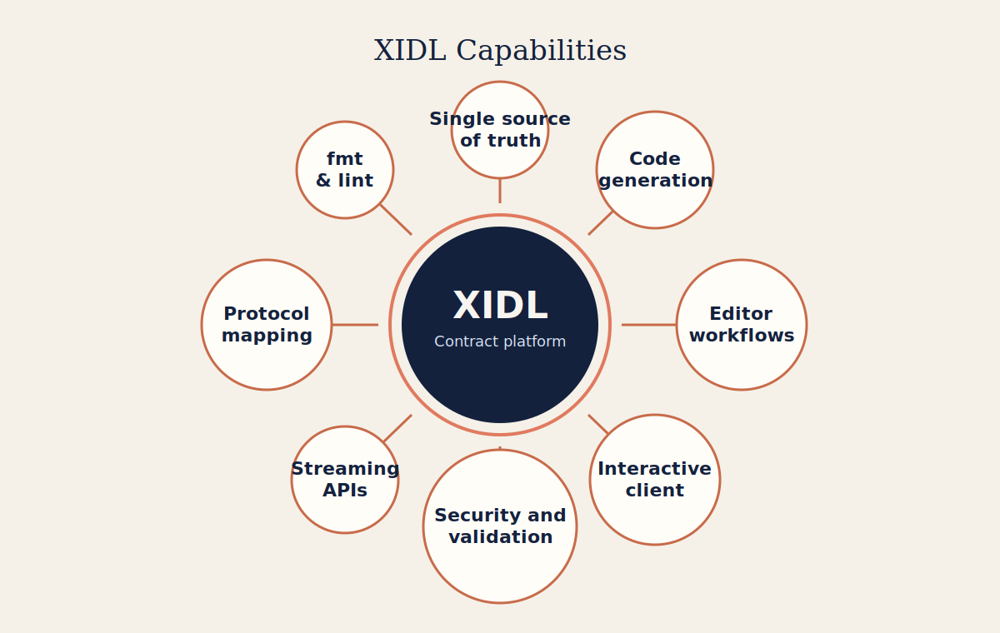
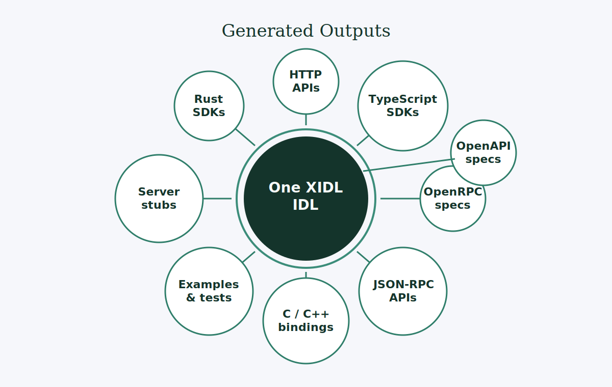
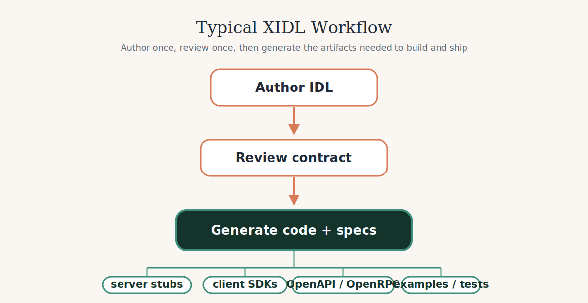

# XIDL


Define interfaces once. Generate APIs, SDKs, specs, and tooling from one
source of truth.

XIDL is an IDL-first contract platform for teams that want one interface
definition to drive HTTP, JSON-RPC, streaming APIs, security metadata,
generated SDKs, and machine-readable specs. It combines contract authoring,
protocol mapping, code generation, and interactive tooling into one workflow.

[](https://github.com/xidl/xidl/actions/workflows/publish-release.yml)
[](https://github.com/xidl/xidl/actions/workflows/publish-crates.yml)
[](https://github.com/xidl/xidl/actions/workflows/build-docs.yml)
[](https://app.netlify.com/projects/xidl/deploys)
>)
>)

[](https://marketplace.visualstudio.com/items?itemName=cathaysia.vscode-idl-language)
[](https://github.com/xidl/xidl)

## What XIDL Makes Possible



XIDL works well as the contract layer for API teams because interface intent is
explicit, structured, and centralized. That makes the system easier for humans
to review and easier for tools and AI systems to understand, generate from,
lint, and keep in sync.

## Why Teams Use XIDL

- One contract drives multiple protocols and outputs.
- HTTP and JSON-RPC live in the same interface system instead of separate toolchains.
- Streaming and security annotations stay attached to the contract, not scattered across framework code.
- Specs, SDKs, stubs, examples, and tests can all be generated from the same IDL.
- Structured contracts are easier for automation, agents, and interactive tools to reason about.

## Core Capabilities

- Interface-first development with OMG IDL-compatible foundations and XIDL extensions.
- Protocol mappings for HTTP and JSON-RPC, plus stream-oriented workflows.
- Generated outputs for Rust, TypeScript, C, C++, OpenAPI, and OpenRPC.
- Security-aware contracts including HTTP auth and API key mappings.
- Formatting support through `xidlc fmt`.
- Editor and language tooling through [`idl-language-server`](https://github.com/xidl/idl-language-server).
- Interactive HTTP exploration from IDL, including launching client workflows with tools such as Scalar.

## What One IDL Produces



One XIDL contract can radiate into runtime surfaces, generated SDKs, machine
readable specs, and implementation assets that stay aligned because they come
from the same source.

## What You Can Build

- HTTP services and generated clients from one IDL contract.
- JSON-RPC services and generated clients from the same modeling approach.
- OpenAPI and OpenRPC specs that stay aligned with implementation contracts.
- Stream-oriented APIs with shared contract semantics.
- Contract-driven examples, tests, and review flows.

## How Teams Use XIDL



Teams author and review the contract once, then generate the artifacts they
need to build servers, ship clients, publish specs, and keep examples and tests
synchronized.

## Quick Start

Install `xidlc`:

```bash
cargo install xidlc
```

Format IDL files:

```bash
xidlc fmt --inplace api.idl
```

Use this repository as a `pre-commit` hook:

```yaml
repos:
  - repo: https://github.com/xidl/xidl
    rev: v0.31.0
    hooks:
      - id: xidlc-fmt
```

Generate Rust types:

```bash
xidlc gen --out-dir out rust api.idl
```

Generate an Axum HTTP surface:

```bash
xidlc gen --out-dir out rust-axum api.idl
```

Generate OpenAPI:

```bash
xidlc gen --out-dir generated openapi api.idl
```

## Documentation

- [Quickstart](website/src/content/docs/guide/quickstart.mdx)
- [Installation](website/src/content/docs/guide/quickstart.mdx)
- [Using xidlc](website/src/content/docs/docs/xidlc.mdx)
- [HTTP Guide](website/src/content/docs/docs/http.mdx)
- [JSON-RPC Guide](website/src/content/docs/docs/jsonrpc.mdx)
- [Targets Reference](website/src/content/docs/docs/targets.mdx)
- [HTTP RFC](website/src/content/docs/rfc/http.mdx)
- [JSON-RPC RFC](website/src/content/docs/rfc/jsonrpc.mdx)

## Ecosystem

- [`xidlc`](https://crates.io/crates/xidlc): compiler and generators
- [`xidl-build`](https://crates.io/crates/xidl-build): Rust `build.rs` integration
- [`xidl-rust-axum`](xidl-rust-axum/README.md): Axum runtime for generated HTTP services
- `xidl-jsonrpc`: JSON-RPC runtime support
- [`idl-language-server`](https://github.com/xidl/idl-language-server): editor support, diagnostics, and interactive workflows

## Status

HTTP and JSON-RPC are available today. Stream support exists and continues to
evolve, especially in the more advanced transport and interactive workflows.
