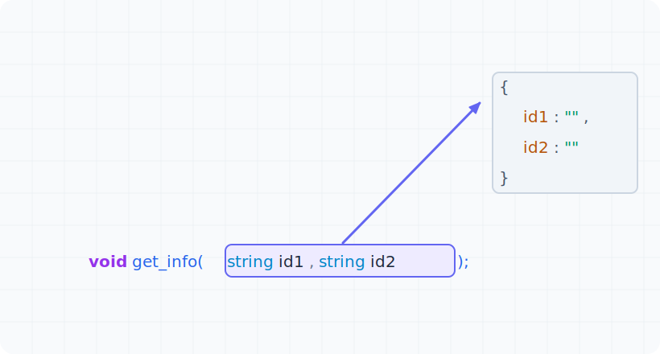
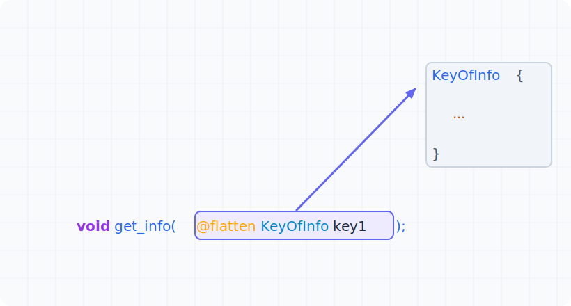
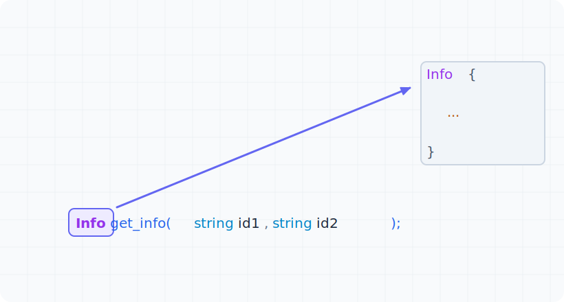
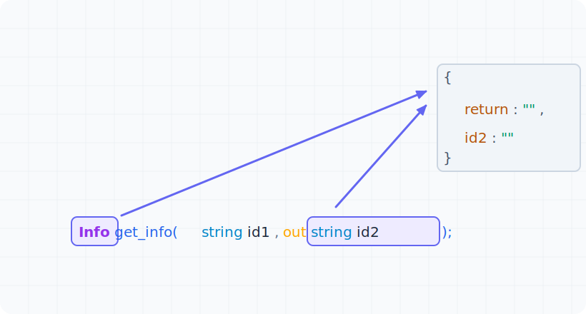

XIDL supports modifying serialization and deserialization behavior through annotations.

| Annotation                            | Action                                       | Scope                             |
| ---                                   | ---                                          | ---                               |
| @rename("new_name")                   | Rename a parameter or field                  | Method parameters, struct fields  |
| @rename_all("rule")                   | Bulk rename parameters or fields             | Method parameters, struct fields  |
| @skip                                 | Skip serialization/deserialization of a field| Struct fields                     |

## Rename All Fields

The `@rename_all` annotation allows bulk renaming of method parameters or struct fields. Supported naming rules include:

- None
- lowercase
- UPPERCASE
- PascalCase
- camelCase
- snake_case
- SCREAMINGSNAKECASE
- kebab-case
- SCREAMING-KEBAB-CASE

## Parameter Encoding Methods

### Multi-parameter Input Encoding Method

### Single-parameter Input Flattened Encoding Method

### Return Value Encoding Method

### Multi-return Value Encoding Method

