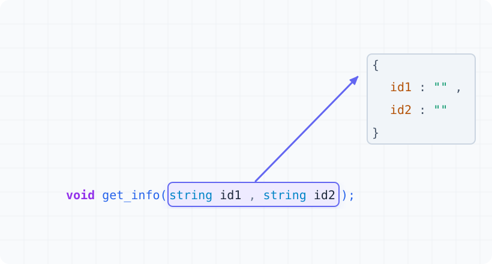
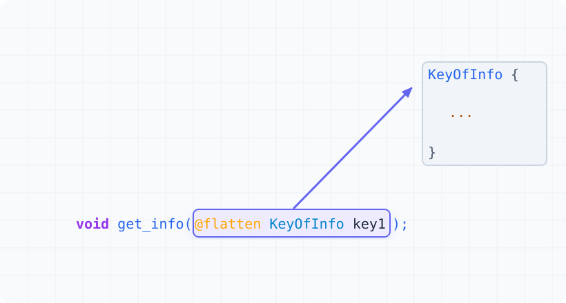
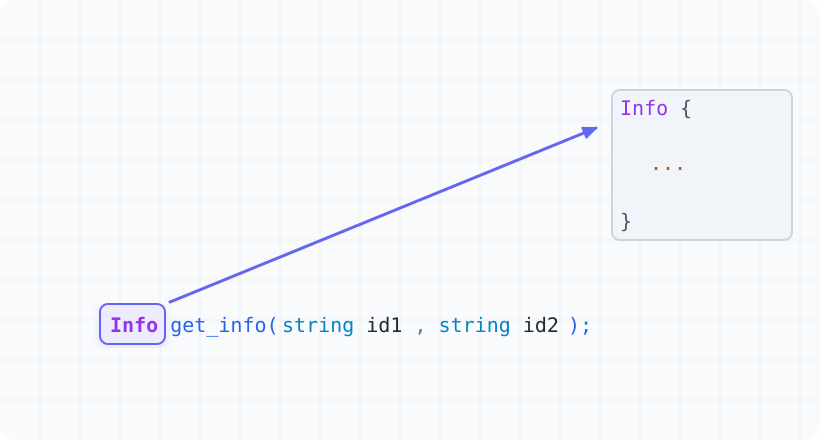
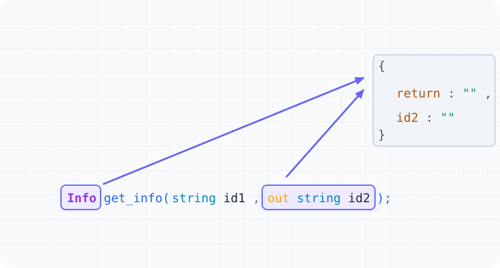

This page describes how method parameters and return values are shaped into
HTTP request and response bodies.

Renaming and skipping annotations (`@rename`, `@rename_all`, `@skip`,
`@optional`) are documented on the [Annotations](../../docs/annotations/) page.

## Parameter Encoding Methods

### Multi-parameter Input Encoding Method

### Single-parameter Input Flattened Encoding Method

### Return Value Encoding Method

### Multi-return Value Encoding Method

## Recommended Reading

- [HTTP & REST Basics](../)
- [Annotations](../../docs/annotations/)
