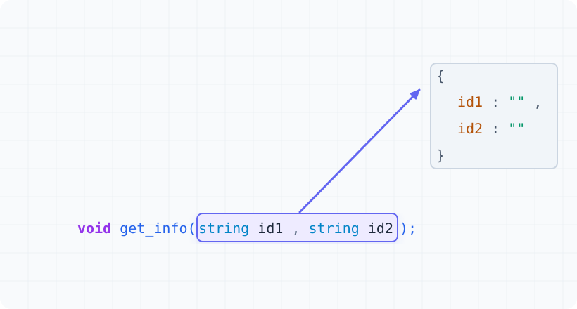
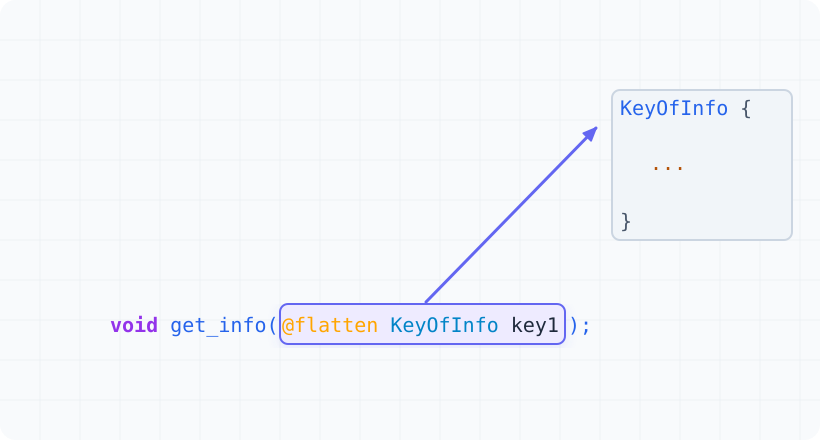
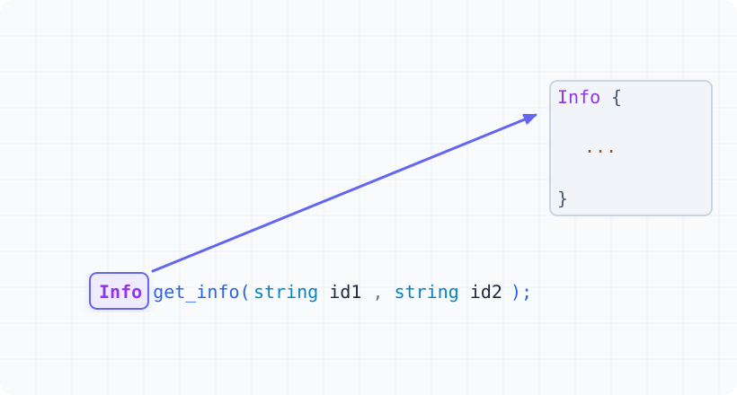
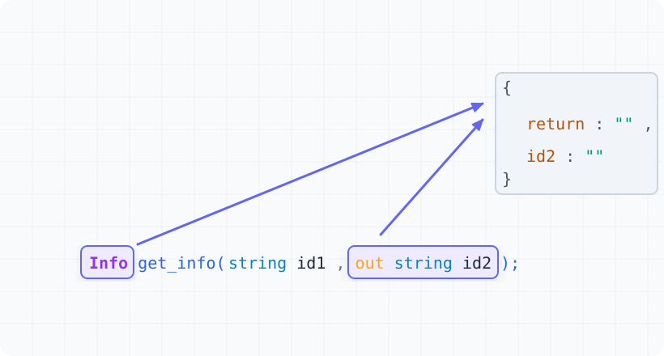

This page describes how method parameters and return values are shaped into
HTTP request and response bodies.

Renaming and skipping annotations (`@rename`, `@rename_all`, `@skip`,
`@optional`) are documented on the [Annotations](../../docs/annotations/) page.

## Parameter Encoding Methods

### Multi-parameter Input Encoding Method



### Single-parameter Input Flattened Encoding Method



### Return Value Encoding Method



### Multi-return Value Encoding Method



## Multiple Response Media Types

Use one operation returning an `@http union` when the same route can return
several representations. `ContentType` is built into the compiler; no enum
declaration or include is needed.

```idl
struct FileMeta { string title; };

@http
union FileResponse switch (ContentType) {
    case Json: FileMeta meta;
    case OctetStream: sequence<octet> raw;
    case Text: string text;
};

@no_security
interface Files {
    @get(path = "/file")
    FileResponse read(@header @rename("ETag") out string etag);
};
```

| Built-in member | Response Content-Type |
| --- | --- |
| `Json` | `application/json` |
| `OctetStream` | `application/octet-stream` |
| `Text` | `text/plain` |

Each union may use a subset of these members. Every branch needs one distinct
member label; `default` branches and custom discriminator types are rejected.
The response body contains the selected payload, without a JSON union tag.
The handler selects the variant, and the server checks that the request's
`Accept` header permits that variant. Response headers and cookies remain
operation output parameters. OpenAPI lists the declared media types under the
same operation's success response.

With an `@http union` present, root-level `ContentType` is reserved. If a local
declaration shadows it, use `switch (::ContentType)` to refer to the built-in
one. Qualified case labels such as `::ContentType::Json` are also supported.
Ordinary unions without `@http` retain their existing discriminator and
`default` rules. HTTP representation generation is supported by Rust Axum,
TypeScript REST, and OpenAPI; it is not currently supported by Go REST.

## Recommended Reading

- [HTTP & REST Basics](../)
- [Annotations](../../docs/annotations/)
